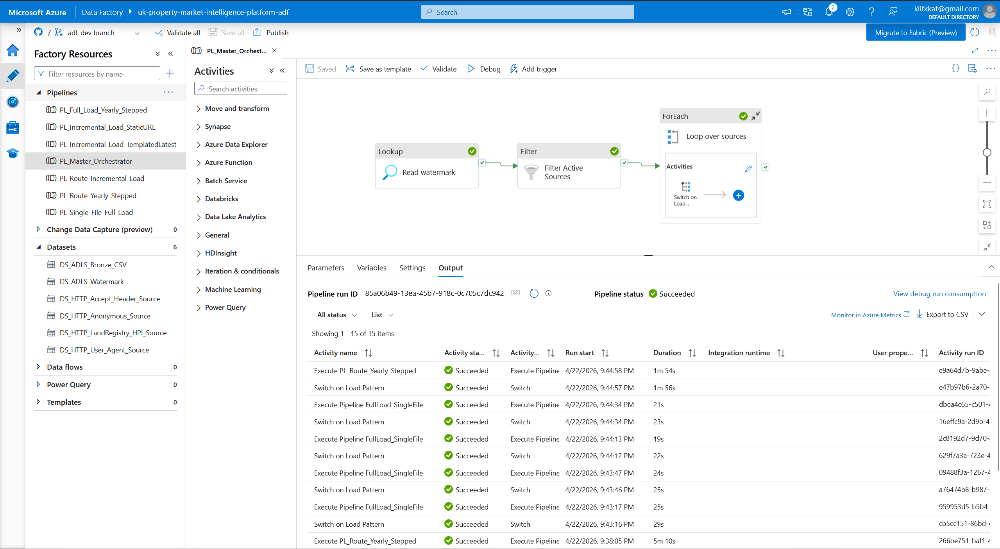

# UK Property Market Intelligence Platform
Built by Md. Rais Al Kabir Joy · [GitHub](https://github.com/joy7652)

A config-driven, multi-source Azure data platform ingesting UK residential property market data across six official open datasets. Demonstrates production-grade data engineering practices including incremental ingestion, schema evolution handling, automated data quality validation, and statistical anomaly detection.

> **Status:** Phase 1 complete — Bronze ingestion layer live for all six sources with full-load, stepped backfill, and incremental mechanisms. Phase 2 (Databricks Silver layer) in development.

---

## Table of contents

- [Elevator pitch](#elevator-pitch)
- [Architecture](#architecture)
- [Data sources](#data-sources)
- [Key engineering decisions](#key-engineering-decisions)
- [Bugs found and fixed](#bugs-found-and-fixed)
- [Tech stack](#tech-stack)
- [Repository structure](#repository-structure)
- [Running the pipelines](#running-the-pipelines)
- [Roadmap](#roadmap)

---

## Elevator pitch

A configurable, multi-source data engineering platform that ingests, validates, transforms, and analyses UK residential property market data. Pipelines are driven by a single JSON configuration file — new sources are added by editing config, not code. The architecture demonstrates watermark-based incremental loading, parameterised linked services, reusable ingestion patterns, and defensive data-quality validation.

**Why this project:** Property data is immediately recognisable to UK hiring managers and used across finance, consulting, and the public sector. Monthly-updated sources frame this as a production pipeline rather than a one-off analysis. The deliberately messy real-world data surfaces non-trivial transformations, and the config-driven architecture demonstrates senior-level thinking — the same framework could ingest any multi-source analytical dataset with no code changes.

---

## Architecture

```
sources_config.json / watermark.json  (Git-integrated)
              ↓
Azure Data Factory  (config-driven orchestration)
              ↓
ADLS Gen2 Bronze  (raw files, 6 sources)
              ↓
Azure Databricks  (quality checks + transform + anomaly detection)
              ↓
ADLS Gen2 Silver → Gold  (Delta Lake, medallion architecture)
              ↓
Azure Synapse Serverless SQL
              ↓
Fabric / Power BI  (Property Dashboard + Pipeline Health Dashboard)
```

### Design principles

- **Config over code.** Adding a source means adding a JSON block to the watermark, not writing a new pipeline.
- **Patterns over sources.** Three ingestion patterns (`yearly_range`, `single_file`, `iterate_list`) cover every source; each source declares which pattern it uses.
- **Trust nothing silently.** Pipeline success status confirms bytes moved, not that the right bytes moved. Binary-format files are validated against expected magic bytes before Silver-layer processing.
- **Parameterised linked services.** HTTP linked services are host-agnostic and configured per-request via `@{linkedService().p_base_url}`, rather than one linked service per host.

---

## Data sources

Six official UK government and regulated open datasets:

| # | Source | Format | Pattern | Step | Update cadence |
|---|--------|--------|---------|------|----------------|
| 1 | HM Land Registry — Price Paid Data (PPD) | CSV, per year | `yearly_stepped` | 1 year | Monthly cumulative increment |
| 2 | HM Land Registry — UK House Price Index (HPI) | CSV, cumulative | `single_file` | — | Monthly |
| 3 | Doogal — UK Postcode Lookup (ONSPD mirror) | ZIP | `single_file` | — | Quarterly |
| 4 | Bank of England — Official Bank Rate | XLS | `single_file` | — | Monthly |
| 5 | ONS — Price Index of Private Rents | XLSX | `single_file` | — | Monthly (URL rotates) |
| 6 | UK Police — Street-level Crime | ZIP (~1.7 GB) | `yearly_stepped` | 2 years | Monthly rolling 3-year snapshot |

### Source rationale

**Price Paid Data** is the authoritative record of UK residential transactions since 1995 — 24M+ records, the backbone of any property analysis. **HPI** provides official price indices validated by the same department, useful as a cross-source oracle for sanity-checking derived metrics. **Postcode lookups** enable geocoding and regional aggregation. **Bank of England rates** and **ONS rents** provide the macro context — affordability analysis needs both the price and the cost of money. **Police crime data** adds a classic property-investment overlay (safety × price growth) that joins cleanly on postcode.

### Source swap: EPC → Police.uk

The original sixth source was MHCLG's Energy Performance Certificates (EPC). During build, I discovered:

1. The existing `epc.opendatacommunities.org` service was being retired on 30 May 2026.
2. Its replacement (`Get energy performance of buildings data` on GOV.UK) required GOV.UK One Login OAuth2 — incompatible with ADF's native HTTP Basic authentication.
3. Waiting for production launch would block the project indefinitely.

I evaluated three paths (push through, wait, or swap) and chose to swap. Police.uk is auth-free, stable since 2010, and has stronger analytical value for a property intelligence platform. The swap required zero new pipeline code — the `single_file` pattern absorbed it directly.

**Key detail discovered through smoke-testing first:** I initially planned a `monthly_backfill` pattern for police.uk, assuming each monthly file was a delta. A pre-build smoke test showed the file was 1.72 GB — revealing each archive is a rolling 3-year snapshot, not a monthly delta. Building a backfill pattern would have wasted 95% of bandwidth and storage. Swapped to `single_file` pattern: latest snapshot only.

---

## Key engineering decisions

### 1. Load patterns are a closed set

Two patterns cover every ingestion shape encountered:

- **`yearly_stepped`** — iterate across years with a configurable step, one file per step. Incremental dispatches to one of two children via `incremental_type`: `static_url` (PPD's cumulative monthly update file) or `templated_latest` (Police.uk's monthly-rotating snapshot URL).
- **`single_file`** — one URL fetches one file per refresh. Used by HPI, Doogal, BoE, ONS.

The `yearly_stepped` pattern was consolidated from an earlier `yearly_range` pattern once Police.uk's 2-year snapshot cadence proved the step parameter's value. Refactored only at the point a concrete second use case demonstrated the abstraction would pay off — deliberate discipline against speculative generalisation upfront.

Incremental logic is itself a three-level route cascade (outer full-vs-incremental decision → month-rate-limiter → type dispatch). The layering exists because Azure Data Factory prohibits nested control-flow activities (If inside Switch inside ForEach), so each layer unwraps exactly one activity.

### 2. Linked services organised by authentication pattern

HTTP linked services are named and organised by their *authentication shape*, not by the data they serve:

| Linked service | Auth/headers | Sources |
|---|---|---|
| `LS_HTTP_Anonymous` | None | PPD, Police.uk |
| `LS_HTTP_User_Agent_Header` | User-Agent only | Doogal |
| `LS_HTTP_Accept_Header` | User-Agent + `Accept: */*` | BoE, ONS |
| `LS_HTTP_LandRegistry_HPI` | Full browser header mimicry (Akamai CDN) | HPI |

This taxonomy is the correct one — auth is a cross-cutting concern that multiple unrelated sources can share, while the data source itself is incidental. An earlier iteration named one linked service after its first data source (`LS_HTTP_LandRegistry`), which obscured the fact that Police.uk could reuse it. Renaming to `LS_HTTP_Anonymous` clarified the taxonomy and eliminated the need for a duplicate linked service.

Each linked service's base URL is parameterised via `@{linkedService().p_base_url}` and passed through at dataset runtime. Datasets in turn expose their own `p_base_url` parameter via `@dataset().p_base_url` on the dataset's Base URL field. This chain means any source can use any linked service, with runtime binding of the host.

### 3. Watermark stored as JSON array in ADLS

The watermark (per-source state: last ingestion date, URL parameters, load pattern) lives at `config/watermark/watermark.json` in ADLS. Design decisions:

- **Array, not object** — ADF's Lookup + ForEach only iterates arrays cleanly.
- **ADLS, not Azure SQL** — eliminates an entire database dependency. When Databricks joins the stack, the watermark migrates to a Delta table.
- **Manual updates for now** — Databricks notebook to programmatically update watermark on successful runs is planned.

### 4. Master orchestration pattern

```
PL_Master_Orchestrator
├─ Lookup: read watermark.json
├─ Filter: keep only active sources (handles soft-disable via active: false)
└─ ForEach (sequential):
    └─ Switch on load_pattern:
        ├─ yearly_range  → Execute PL_Route_YearlyRange
        ├─ single_file   → Execute PL_FullLoad_SingleFile
        └─ Default       → log and skip
```

`PL_Route_YearlyRange` exists because ADF prohibits nested control-flow activities (e.g. `If` inside `Switch`). Extracting the inner logic into a child "route" pipeline preserves the full-vs-incremental branch for yearly sources. This constraint drove cleaner separation of concerns: orchestration → routing → execution.

### 5. Three-layer data lake (medallion)

- **Bronze** — raw files as received, no transformation, one folder per source.
- **Silver** — validated, typed, quality-checked, schema-enforced. Delta format.
- **Gold** — joined, enriched, denormalised for analytical consumption.

Bronze is complete. Silver and Gold are the next phase.

---

## Bugs found and fixed

### Latent parameter-shadowing bug in dataset configuration

**Discovered:** During ONS source onboarding — when the ONS URL was updated in the watermark for a new monthly release, the pipeline continued writing files to ADLS under the correct name but with wrong content. ADF reported "Succeeded" for every run.

**Symptoms:**
- `openpyxl.load_workbook()` failed with `BadZipFile: File is not a zip file`.
- Hex-dump of the "XLSX" showed HTML content starting `<!DOCTYPE html>`.
- The HTML was from `bankofengland.co.uk`, not `ons.gov.uk` — meaning the pipeline was fetching from the wrong host.

**Root cause:** HTTP datasets had parameters defined (`p_base_url`, `p_relative_url`) but their Base URL fields were hardcoded rather than using `@dataset().p_base_url`. For five sources this was undetectable because the hardcoded value happened to match the watermark value. When the ONS URL was updated in the watermark, the dataset continued using the stale hardcoded URL — which pointed to BoE's host — and BoE returned a 200 OK HTML homepage for the bad request path.

**Fix:** Replaced every hardcoded URL in dataset Base URL fields with the appropriate `@dataset()` expression. Re-ran master pipeline for affected sources. Validated output files by attempting to parse them in their native format.

**Lesson:** Pipeline success status confirms bytes moved, not that the right bytes moved. Two follow-ups:
1. Adding magic-byte validation to the Silver-layer ingestion contract (every file checked against expected format header before parsing).
2. Audit of every parameterised dataset field to confirm parameters are actually wired, not just defined.

### ADF nested control-flow restriction

**Discovered:** When trying to nest `If Condition` inside `Switch` inside `ForEach` for the yearly-range full-vs-incremental logic.

**Fix:** Extract inner logic into child pipelines (`PL_Route_YearlyRange`). Master Switch calls the route pipeline, route pipeline contains the If Condition. Resulted in cleaner architecture with better separation of concerns.

### URL query-string double-encoding (ONS)

**Discovered:** ONS uses relative URLs of the form `?uri=/path/to/file.xlsx`. ADF URL-encoded the `?` if the relative URL started with anything else, corrupting the request.

**Fix:** Always prefix the relative URL with `?` as the first character. ADF preserves the query-string delimiter when it's at position 0 of the relative URL.

---

## Tech stack

| Layer | Technology |
|---|---|
| Orchestration | Azure Data Factory (Git-integrated) |
| Storage | Azure Data Lake Storage Gen2 |
| Compute (planned) | Azure Databricks (PySpark, Delta Lake) |
| Query (planned) | Azure Synapse Serverless SQL |
| Visualisation (planned) | Microsoft Fabric / Power BI |
| Source control | GitHub |
| CI/CD (planned) | GitHub Actions (JSON validation, pipeline linting) |

---
## Repository workflow

This repository uses dual-source commits:

- **Local commits** cover README, configuration templates, documentation, and (eventually) Databricks notebooks. Standard GitHub flow via feature branches.
- **ADF Studio commits** cover pipeline, dataset, linked service, and trigger JSON. Configured via ADF's GitHub integration; every Save in ADF commits to the `adf-dev` branch. Publish promotes changes to `adf_publish` and the live factory simultaneously.

The `main` branch is periodically synced from `adf-dev` so viewers see current pipeline definitions alongside documentation.
## Repository structure

```
uk-property-intelligence-platform/
├── README.md
├── architecture_diagram.png
├── config/
│   ├── watermark.json              # per-source state, URL parameters, load patterns
│   └── quality_rules.json          # (planned) per-source validation rules for Silver
├── adf/
│   └── pipelines/                  # JSON definitions, synced via ADF Git integration
│       ├── PL_Master_Orchestrator.json
│       ├── PL_FullLoad_Generic.json
│       ├── PL_FullLoad_SingleFile.json
│       ├── PL_Incremental_Generic.json
│       └── PL_Route_YearlyRange.json
├── databricks/                     # (planned) Silver/Gold notebooks, quality framework
├── synapse/                        # (planned) external table definitions
├── .github/workflows/              # (planned) CI/CD
└── docs/
    └── source_discovery_notes.md   # notes on each source's quirks, auth patterns
```

---

## Running the pipelines

### Prerequisites

- Azure subscription with:
  - Azure Data Factory instance (Git-integrated with this repo)
  - ADLS Gen2 storage account with a `raw` container
  - ADF managed identity granted `Storage Blob Data Contributor` on the storage account
- Watermark file uploaded to `'config/watermark/watermark.json` in ADLS

### Initial load

1. Ensure all `active` flags in the watermark are set as desired (set unneeded sources to `active: false` to skip).
2. Trigger `PL_Master_Orchestrator` from ADF Studio or via trigger.
3. On first run, `yearly_range` sources (PPD) iterate from `start_year` to current year.

### Incremental loads

For sources with `full_load_complete: true` and a valid `last_year_ingested` or `last_refreshed` date, subsequent runs of the master pipeline fetch only new data.

### Monthly manual updates

Two sources have fully-dynamic URLs that change with each release and require watermark updates:

- **HPI** — update `relative_url` with new monthly filename.
- **ONS Private Rents** — update `relative_url` with new monthly path and filename.
- **Police.uk** — update `relative_url` with latest monthly archive.

Databricks notebook to automate these URL updates via pattern matching is planned.

---

## Roadmap

### Phase 1 — Bronze ingestion ✅

- [x] ADF instance with Git integration (repo: uk-property-intelligence-platform)
- [x] 4 linked services organised by authentication pattern
- [x] Parameterised HTTP + ADLS datasets (base URL parameter chain)
- [x] `PL_FullLoad_YearStepped` — generalised full-load for stepped yearly patterns
- [x] `PL_FullLoad_SingleFile` — switch-routed single-file full-load
- [x] `PL_Incremental_Route` — month-rate-limited incremental router
- [x] `PL_Incremental_StaticURL` — static-URL incremental (PPD)
- [x] `PL_Incremental_TemplatedLatest` — templated-URL incremental (Police.uk)
- [x] `PL_Route_YearStepped` — full-vs-incremental router for year-stepped sources
- [x] `PL_Master_Orchestrator` — watermark-driven orchestration with active-source filtering
- [x] All 6 sources landing in Bronze with verified file integrity
### Phase 2 — Silver layer (next)

- [ ] Databricks workspace + cluster
- [ ] Parameterised quality-rules framework (`quality_rules.json`)
- [ ] Schema enforcement with Delta Lake
- [ ] Magic-byte validation for binary inputs
- [ ] Quarantine table for rejected records
- [ ] `pipeline_audit` table for per-run quality scores

### Phase 3 — Gold layer

- [ ] Multi-source joins on postcode
- [ ] Enrichment: price × rent yield, price × rate affordability, price × crime index
- [ ] Denormalised analytical tables

### Phase 4 — Advanced features

- [ ] Statistical anomaly detection (3-sigma rolling window on price changes)
- [ ] Delta Lake schema evolution demonstration
- [ ] Watermark automation via Databricks (replace manual JSON editing)
- [ ] GitHub Actions CI/CD (JSON schema validation for ADF pipelines and config)

### Phase 5 — Consumption

- [ ] Synapse Serverless external tables over Gold
- [ ] Fabric / Power BI dashboards:
  - Property Market Dashboard (price trends, rent yields, crime overlay)
  - Pipeline Health Dashboard (run history, quality scores, anomaly alerts)

---

## Architectural talking points

This project deliberately demonstrates engineering judgement, not just tool fluency:

- **Recognising latent defects** — the ONS bug was caught through local validation, not by trusting pipeline status.
- **Discovery before build** — the police.uk smoke test saved building the wrong pattern.
- **Risk assessment before commitment** — the EPC pivot was a deliberate decision when the source environment changed mid-project.
- **Deferred abstractions** — three load patterns remain separate until consolidation has a clear payoff.
- **Silent-failure prevention** — magic-byte validation is a design response to the ADF "success" story being insufficient.

---

## Licence

© 2026 Md.Rais Al Kabir Joy. All rights reserved.

This repository is published for portfolio and demonstration purposes. The source code, configuration, and documentation may not be copied, modified, distributed, or used in derivative works without express written permission. Viewing and referencing for evaluation purposes (e.g. by prospective employers) is permitted.

---

*Project status: Phase 1 complete as of April 2026.*
